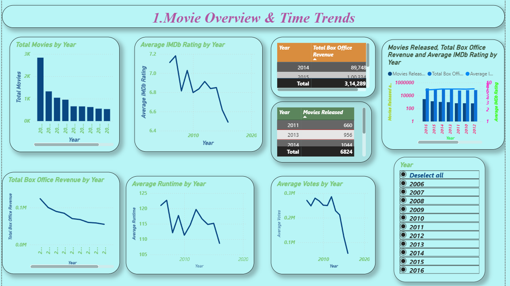
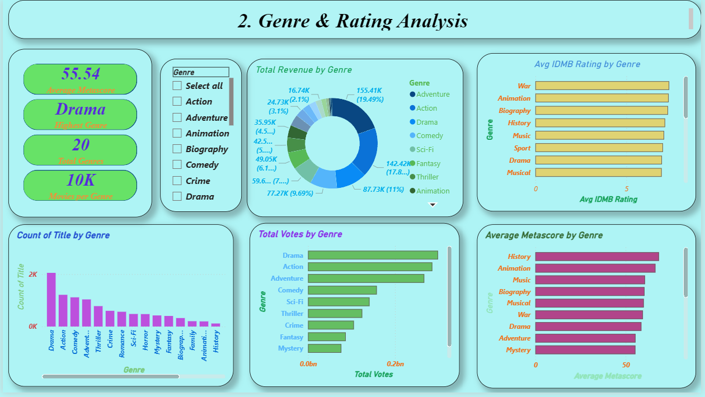
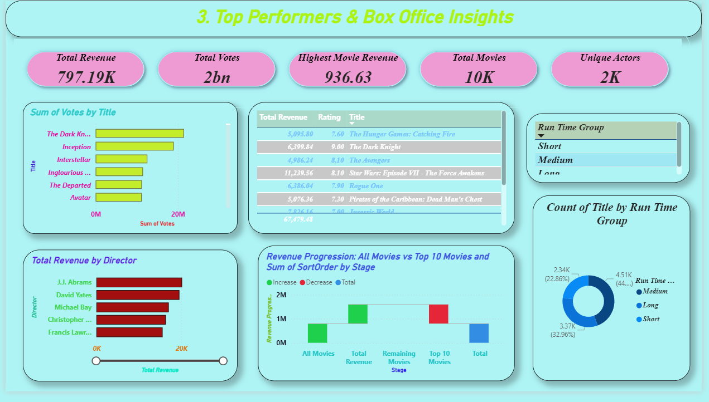
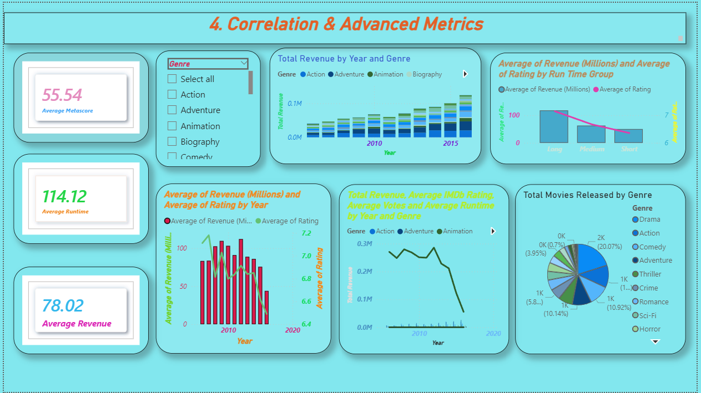

# Power BI Movie Analysis Dashboard

This project presents an interactive movie analysis dashboard developed using Power BI.

## Project Overview
- Analyzed movie data based on genre, ratings, revenue, and release year
- Designed interactive visuals to explore trends and performance
- Created KPIs to understand audience preferences and movie success

## Key Features
- Interactive slicers and filters
- Drill-down analysis
- Clean and visually appealing dashboard
- User-friendly insights for decision-making

## Tools & Technologies
- Power BI
- Power Query
- DAX
- Data Modeling

## Dashboard Preview

